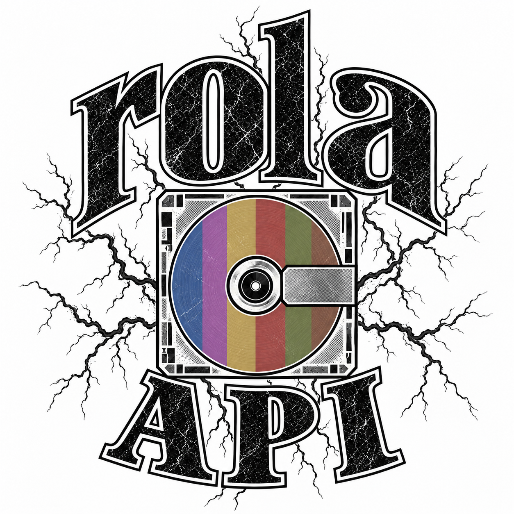
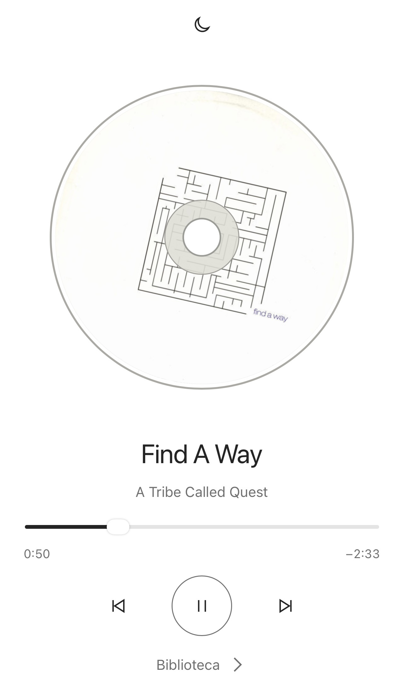
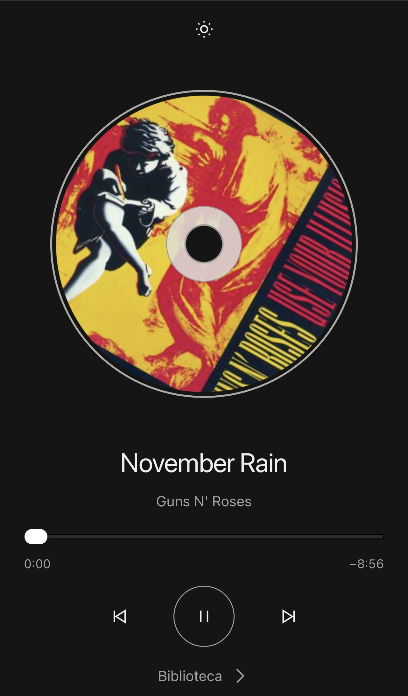
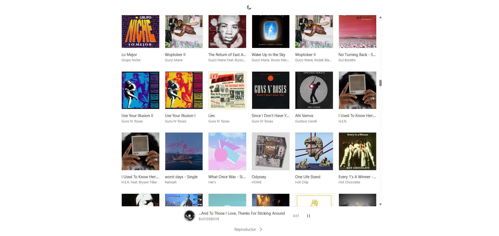
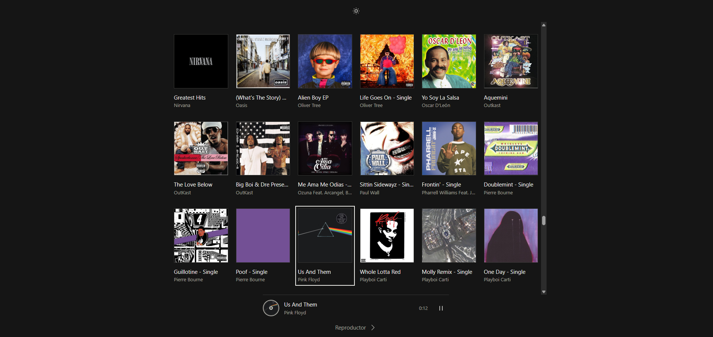

<p align="center">
  
</p>

<p align="center">MP3 Streaming API & Web Player</p>

---

rola is a personal music server: a Python API streams your MP3 files to a browser player. One engine serves both.

## Install

You need Windows and Python 3.12 or newer. Internet is required for setup.

Clone or download this repo. Add your music to `mp3/`; subfolders work too.

Open the repo folder in File Explorer, type `powershell` in the address bar, and press Enter. Run setup once:

```powershell
py api/initial_setup/iniciar.py
```

Setup installs dependencies in `.venv` and asks permission to enable LAN access. Approve the Windows prompt and keep your home network marked **Private**.

Start the engine:

```powershell
py api/servidor.py
```

You can close PowerShell. The engine runs until stopped or the computer shuts down; keep it awake while listening. After a reboot, run the same start command. The browser does not open automatically.

Stop the engine:

```powershell
py api/servidor.py stop
```

## What it does

rola:

1. Reads MP3 files and their title, artist, album, and duration.
2. Displays embedded JPEG or PNG cover art.
3. Streams audio with seeking, without modifying your music.
4. Keeps playback running while you browse Biblioteca or change the theme.

Use **Actualizar biblioteca** after adding or removing files. Albums are grouped by album and artist tags; songs without album tags appear individually. Different artists split compilations into separate groups.

## Output

| Listen from | Open in your browser |
| --- | --- |
| The host computer | `http://localhost:8000` |
| Another LAN device | The `Your network` address printed at startup |

If LAN access fails, check the Windows **Private** network profile and avoid guest Wi-Fi or client isolation. If setup permission was declined, stop rola and rerun setup. Startup errors are recorded in `rola.log`.

## Demo

| Player · day | Player · night |
| :---: | :---: |
|  |  |

| Library · day | Library · night |
| :---: | :---: |
| [](assets/biblioteca-dia.png) | [](assets/biblioteca-noche.png) |


## Scope and limits

**Local & LAN:** the same engine serves the computer and reachable devices on your home network. Playback needs no internet.

**Cloud:** the same code and commands work on a Windows VM with Python and your music. Configure its firewall separately. For private internet access, use a VPN or an HTTPS reverse proxy with authentication; restrict direct access to port 8000.

Optional settings, applied before starting:

| PowerShell setting | Purpose |
| --- | --- |
| `$env:ROLA_MUSIC_DIR = 'D:\Music'` | Use another music folder |
| `$env:ROLA_HOSTS = 'music.example.com'` | Allow a custom hostname; DNS is configured separately |

MP3 only; M4A and external iTunes artwork are not read. Files in `mp3/` are ignored by Git. There is no login or built-in HTTPS: anyone who can reach the server can listen.

See [SECURITY.md](SECURITY.md) for security notes.

## License

rola is released under the [MIT License](LICENSE). Music and third-party album artwork are not covered by this license.
